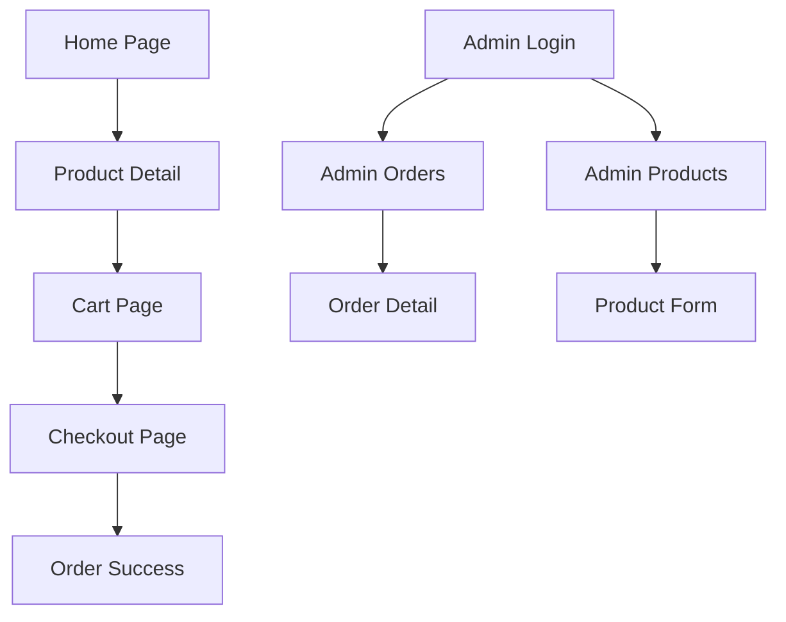

## 1. Product Overview
Mini-store e-commerce application allowing anonymous customers to browse products and place orders, with authenticated admin panel for order and product management. Built with React, Firebase, and optional Stripe integration.

Target users: Small business owners needing a simple online store with minimal setup and admin management capabilities.

## 2. Core Features

### 2.1 User Roles
| Role | Registration Method | Core Permissions |
|------|---------------------|------------------|
| Anonymous Customer | No registration required | Browse products, add to cart, place orders |
| Admin | Email/password authentication | Manage products, view/update orders, access admin dashboard |

### 2.2 Feature Module
Our mini-store requirements consist of the following main pages:
1. **Home page**: product grid, navigation, cart icon with item count
2. **Product detail page**: product information, add to cart functionality
3. **Cart page**: item management, quantity updates, remove items
4. **Checkout page**: customer form, order validation, order creation
5. **Order success page**: confirmation message, order number display
6. **Admin login page**: email/password authentication
7. **Admin orders page**: order list, status management, filtering
8. **Admin products page**: product CRUD operations, inventory management

### 2.3 Page Details
| Page Name | Module Name | Feature description |
|-----------|-------------|---------------------|
| Home page | Product grid | Display all products with images, names, prices. Show add to cart button on hover. |
| Home page | Navigation | Header with store logo, cart icon showing item count, admin login link. |
| Product detail | Product info | Show large image, name, description, price, stock status, quantity selector. |
| Product detail | Add to cart | Button to add selected quantity to cart with success feedback. |
| Cart page | Item list | Display cart items with images, names, individual prices, quantities. |
| Cart page | Quantity control | Input field to update quantity, remove button for each item. |
| Cart page | Cart summary | Show subtotal, shipping, total. Proceed to checkout button. |
| Checkout page | Customer form | Collect name, phone (8-12 digits), address with validation. |
| Checkout page | Order validation | Check product availability, calculate total, create order. |
| Order success | Confirmation | Display order number, success message, clear cart. |
| Admin login | Authentication | Email/password form with Firebase auth integration. |
| Admin orders | Order management | Table with orders, status badges, filter by status, update status. |
| Admin products | Product CRUD | List products, add new product, edit existing, delete with confirmation. |

## 3. Core Process

### Customer Flow
1. Browse products on home page
2. View product details and add to cart
3. Review cart contents
4. Proceed to checkout
5. Fill customer information form
6. Submit order (creates pending order in Firestore)
7. View order confirmation page

### Admin Flow
1. Login with email/password
2. View dashboard with orders overview
3. Manage order statuses (pending→paid→preparing→shipped→done)
4. CRUD operations on products
5. Logout when finished

## 4. User Interface Design

### 4.1 Design Style
- **Primary color**: Blue (#3B82F6) for primary actions and links
- **Secondary color**: Gray (#6B7280) for secondary elements
- **Button style**: Rounded corners with hover effects
- **Font**: System fonts with 16px base size
- **Layout**: Card-based grid for products, clean white background
- **Icons**: Simple emoji or SVG icons for cart, admin, etc.

### 4.2 Page Design Overview
| Page Name | Module Name | UI Elements |
|-----------|-------------|-------------|
| Home page | Product grid | Responsive grid (3 columns desktop, 1 mobile), white cards with shadow, product images with 16:9 ratio, price in bold blue. |
| Cart page | Item list | Vertical list with product thumbnails, quantity input fields, remove buttons in red. |
| Checkout page | Form | Clean form with labels above inputs, validation messages in red, submit button full width. |
| Admin orders | Table | Striped rows, status badges with colors (pending=yellow, paid=green, etc.), action buttons. |

### 4.3 Responsiveness
Desktop-first design approach with mobile responsiveness. Touch-friendly buttons and forms. Cart drawer option for mobile devices.